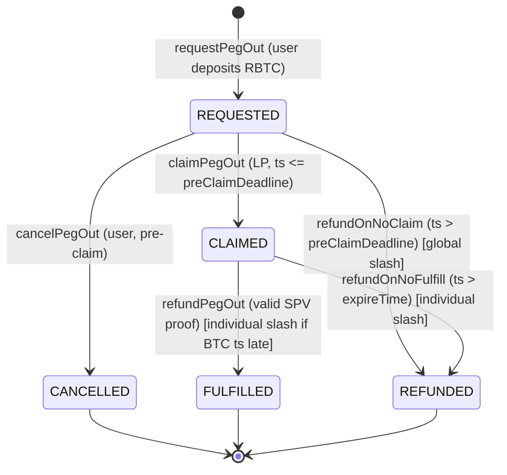

# Peg-out escrow state machine (PoC)

Output of S0.1. Frozen for the PoC. Source: proposal `IPegOutEscrow` and "Negative scenarios" peg-out list, plus the locked race decisions in `../01-escrow-state-machine-spec/story.md`.

## States

| State | Meaning | Terminal |
|---|---|---|
| `REQUESTED` | User deposited RBTC into the escrow, awaiting an LP claim. | no |
| `CLAIMED` | An LP claimed and is responsible for delivering BTC. | no |
| `FULFILLED` | LP delivered BTC and submitted a valid SPV proof; LP recovered RBTC plus fee. | yes |
| `CANCELLED` | User cancelled before any claim; RBTC returned. | yes |
| `REFUNDED` | RBTC returned to the user after a failed service. | yes |

## Diagram

## Transition table

| From | Function | Caller | Guard | To | Effects |
|---|---|---|---|---|---|
| start | `requestPegOut` (payable) | user | amount = value + callFee; request within config limits | `REQUESTED` | hold RBTC; emit `PegOutRequested` |
| `REQUESTED` | `claimPegOut(quoteHash, sig)` | registered LP | `block.timestamp <= preClaimDeadline`; not already claimed | `CLAIMED` | move RBTC to `PegOutContract`; mark LP responsible; emit `PegOutClaimed` |
| `REQUESTED` | `cancelPegOut` | user | still `REQUESTED` | `CANCELLED` | refund RBTC to user; emit `PegOutCancelled`; no slash |
| `REQUESTED` | `refundOnNoClaim` | user or watchtower | `block.timestamp > preClaimDeadline`; request was serviceable | `REFUNDED` | refund RBTC to user; global slash all registered LPs |
| `CLAIMED` | `refundPegOut(proof)` | LP or watchtower | valid SPV proof of BTC delivery to destination | `FULFILLED` | LP recovers RBTC plus fee; top up the user if delivered amount is short; individual slash if BTC tx timestamp exceeds `callTime` plus the delivery-grace tolerance |
| `CLAIMED` | `refundOnNoFulfill` | user or watchtower | `block.timestamp > expireTime`; no valid fulfillment | `REFUNDED` | refund RBTC to user; individual slash the responsible LP |

Any transition not listed is rejected.

## Race resolutions (locked)

- **Cancel vs claim (both target `REQUESTED`):** first transaction mined wins; the loser reverts. No gas-price cap. Pre-claim, both outcomes are safe.
- **Claim vs pre-claim-deadline:** `claimPegOut` is gated by `block.timestamp <= preClaimDeadline` and `refundOnNoClaim` by `block.timestamp > preClaimDeadline`, so the outcome is deterministic and the first mined transaction wins.
- **Slash vs late delivery:** adjudicated by the BTC transaction timestamp via SPV, not by submission order. The individual slash fires only when the BTC tx timestamp exceeds `callTime` plus the delivery-grace tolerance.

## No release path

Once an LP claims, there is no path from `CLAIMED` back to `REQUESTED` or to `CANCELLED`. A claim is a hard commitment: the LP either reaches `FULFILLED` or the escrow reaches `REFUNDED` with an individual slash.

## Two fulfillment edge cases

- **Late but delivered:** the BTC was delivered but its timestamp exceeds `callTime` plus the grace tolerance. The escrow still reaches `FULFILLED` (the user has the BTC) and the LP recovers RBTC, but the LP takes the individual slash.
- **Delivered, proof not submitted:** the LP delivered BTC but never submitted the proof, so the user can reach `REFUNDED` and keep the BTC (duplicated funds). The Watchtower (E10b) covers this by submitting `refundPegOut` on the LP's behalf, pushing the escrow to `FULFILLED` instead.
