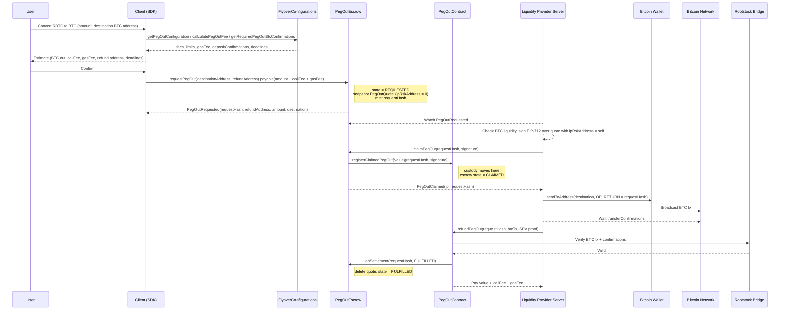
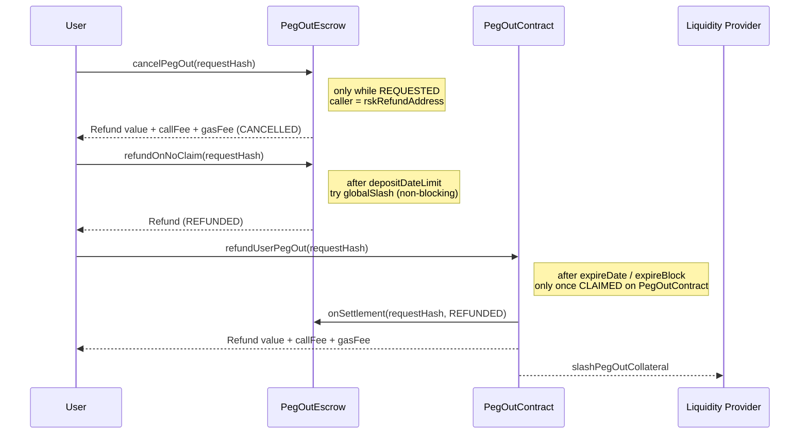
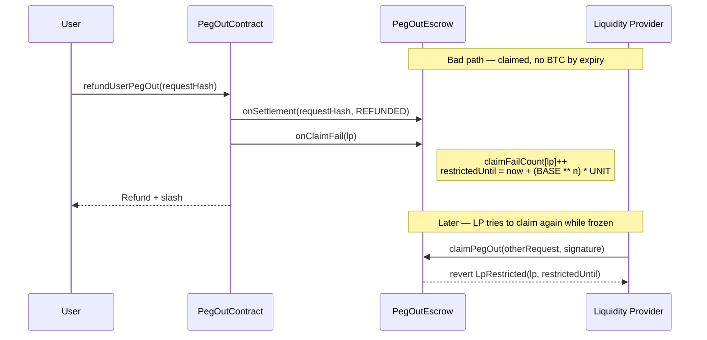

# Commit-first peg-out PoC

This document describes **what the current PoC code does** (`PegOutEscrow` + wiring on `PegOutContract` / `FlyoverConfigurations`). It is not a full redesign of peg-out settlement: SPV validation and LP payout still live on today’s `PegOutContract`.

---

## PoC flow (current code)



### Failure / exit paths in the PoC

These are the exits implemented today (no watchtower / third-party settlement window).



---

## Role of PegOutEscrow (this PoC)

`PegOutEscrow` is the commit-first layer on top of existing peg-out settlement.

| Responsibility                                                                                                                      | Contract                |
| ----------------------------------------------------------------------------------------------------------------------------------- | ----------------------- |
| User commitment, fee split, quote snapshot, claim race                                                                              | `PegOutEscrow`          |
| Lifecycle enum (`NONE` → `REQUESTED` → `CLAIMED` → `FULFILLED` / `REFUNDED`; or `REQUESTED` → `CANCELLED` / `REFUNDED` on no-claim) | `PegOutEscrow`          |
| SPV proof, bridge checks, LP payout, individual slash                                                                               | `PegOutContract`        |
| Shared fees / windows / confirmations                                                                                               | `FlyoverConfigurations` |

At **claim**, escrow forwards `value + callFee + gasFee` into `registerClaimedPegOut` and stops holding the RBTC. At **settlement**, PegOutContract pays the LP (or refunds the user) and calls `onSettlement` so escrow can leave `CLAIMED`. Escrow does not re-release funds on settle.

When escrow is wired, legacy `depositPegOut` reverts (`LegacyDepositDisabled`) so the PoC does not run two deposit paths in parallel.

---

## What the PoC contracts do

### `PegOutEscrow`

- `requestPegOut(destination, refundAddress)` — requires non-zero `refundAddress`; splits `msg.value` into `amount + callFee + gasFee` (+ dust change); stores quote; emits lean `PegOutRequested`.
- `cancelPegOut` — refund while `REQUESTED` (no slash).
- `claimPegOut` — eligible LP sets `lpRskAddress`, moves funds via `registerClaimedPegOut`.
- `refundOnNoClaim` — after claim window; `try/catch` around `globalSlash` so the user always gets paid.
- `onSettlement` — PegOutContract-only; terminal `FULFILLED` / `REFUNDED`.

### `PegOutContract` (PoC wiring only)

- `registerClaimedPegOut(requestHash, signature)` — escrow-only entry; loads quote from escrow while `CLAIMED`.
- Existing `refundPegOut` / `refundUserPegOut` notify escrow via `onSettlement` when the request was claim-first.
- `setPegOutEscrow` — admin wire-up.

### `FlyoverConfigurations` (peg-out slice)

Separate ERC-7201 namespace + `initializePegOut` / `queuePegOutChange` / `applyPegOutChange`. Escrow reads `gasFee`, `depositConfirmations`, fees, windows, and tiers from here at request time.

`ICollateralManagement.globalSlash` is still stubbed; failures are swallowed for the user refund path.

---

## Deltas from the initial PoC sketch

The first commit-first sketch matched the diagram shape above (user escrows → LP claims → settle on PegOutContract) but left several fields and path choices loose. Relative to that sketch, **the code now**:

- Treats escrow as the lifecycle owner (`onSettlement` stays on escrow; not a optional notify you can drop without changing the PoC shape).
- Uses a stable escrow-minted `requestHash` (not `keccak(encodePegOutQuote)`), lean `PegOutRequested`, and one stored `PegOutQuote` with `lpRskAddress = 0` until claim.
- Pins clocks at **request** so the LP can sign before the claim tx is mined.
- Snapshots `gasFee` and `depositConfirmations` from FlyoverConfigurations (no longer hardcoding zeros that would leave the LP unreimbursed or omit deposit confirmation policy).
- Requires an explicit non-zero `refundAddress`.
- Moves custody at claim through `registerClaimedPegOut` and disables legacy `depositPegOut` when escrow is set, avoiding twin quote state.
- Keeps `globalSlash` off the critical path of `refundOnNoClaim` (`GlobalSlashSkipped`).

The LP claim-and-fail discipline is **not implemented in this PoC**; see the proposed design below.

---

## Claim-and-fail discipline (proposed)

### Motivation

After an LP claims, they hold the user’s funds on `PegOutContract` until SPV settlement or user refund. A bad LP can sit until `expireDate` / `expireBlock`, force `refundUserPegOut`, and repeat. A flat `penaltyFee` slash may be cheap enough to grief serially. Raising the flat fee alone treats one outage like repeated abuse.

### Design

No separate discipline contract and no special role. **Escrow** keeps per-LP fail state and gates **new** `claimPegOut` calls only. Finishing an already-claimed peg-out (SPV `refundPegOut`, user `refundUserPegOut`) is never blocked by the freeze. Admin revoke / unrevoke only toggles the freeze clock — it never resets the fail counter.



### How we see it implemented

**Storage on `PegOutEscrow` (ERC-7201):**

| Field                 | Meaning                                                      |
| --------------------- | ------------------------------------------------------------ |
| `claimFailCount[lp]`  | Strike count `n` (starts at 0)                               |
| `restrictedUntil[lp]` | Unix time; `0` ⇒ not frozen; `type(uint256).max` ⇒ admin ban |
| `RESTRICTION_UNIT`    | `1 days`                                                     |
| `RESTRICTION_BASE`    | `2` → freeze = `(2 ** n) * 1 day`                            |

**`claimPegOut` gate (only new claims):**

```solidity
if (block.timestamp < restrictedUntil[msg.sender]) {
    revert LpRestricted(msg.sender, restrictedUntil[msg.sender]);
}
```

**Automatic bump — only post-claim no-fulfill.** When `PegOutContract.refundUserPegOut` completes for an escrow-claimed request, after (or alongside) `onSettlement(..., REFUNDED)`, call escrow:

```solidity
function onClaimFail(address lp) external onlyPegOutContract {
  uint256 n = ++claimFailCount[lp];
  restrictedUntil[lp] =
    block.timestamp +
    ((RESTRICTION_BASE ** n) * RESTRICTION_UNIT);
}

```

So `n = 1` → 2 days, `n = 2` → 4 days, `n = 3` → 8 days, …

**Admin (does not touch `claimFailCount`):**

```solidity
function revoke(address lp) external onlyRole(DEFAULT_ADMIN_ROLE) {
  restrictedUntil[lp] = type(uint256).max; // indefinite ban
}

function unrevoke(address lp) external onlyRole(DEFAULT_ADMIN_ROLE) {
  restrictedUntil[lp] = 0; // clear freeze only; strikes remain
}

```

| Event                                                    | Bump `claimFailCount`? |
| -------------------------------------------------------- | ---------------------- |
| `refundUserPegOut` after escrow claim (no SPV by expiry) | yes                    |
| `refundPegOut` (LP or anyone settles with proof)         | no                     |
| `cancelPegOut` / `refundOnNoClaim`                       | no                     |
| Successful fulfill                                       | no                     |

**Not in this proposal:** strike decay over time, or `unrevoke` clearing strikes. Freeze ladder + admin ban are enough for the next increment after the PoC.

---

## Open questions (post-PoC)

Two follow-ups are intentionally deferred until after this PoC ships; they should be discussed before a production cutover.

**When to remove `depositPegOut`.** Today the legacy entry point is only gated (`LegacyDepositDisabled` when escrow is wired); the function and `_pegOutQuotes` remain for upgrade-safe layout and residual tests. We should decide when it is safe to delete the API entirely (and drop twin quote storage): after commit-first is the only supported client path, after legacy integrations are migrated, and after we confirm no in-flight deposits still depend on `_pegOutQuotes`.

**Whether to move state control from escrow to PegOutContract.** Review discussion left `onSettlement` and the escrow lifecycle enum on `PegOutEscrow` so the PoC stays a layer on top of settlement. An alternative is a single state machine on `PegOutContract` (escrow only holds funds until claim). That would remove the notify/twin-lifecycle surface but is a different architecture than this PoC — discuss incrementally after the current shape is proven, not as a silent refactor inside this branch.

**Naming symmetry for peg-in config APIs.** Peg-out admin/read helpers are explicitly prefixed (`queuePegOutChange`, `applyPegOutChange`, `getPendingPegOutChange`). Several peg-in counterparts stay unprefixed and read as if they were shared: `queueChange`, `applyChange`, `getPendingChange`. Suggestion: rename to `queuePegInChange`, `applyPegInChange`, and `getPendingPegInChange` so the pair is obvious and nothing looks like a generic config path. Getters that already say PegIn (`getPegInConfiguration`, `calculatePegInFee`, `getRequiredPegInBtcConfirmations`, `getPegInConfigurationBounds`) can stay. This is an ABI break on the frozen `IFlyoverConfigurations` surface — schedule it deliberately (aliases + deprecation, or a single cross-lane rename), not as a drive-by in the escrow PoC.
